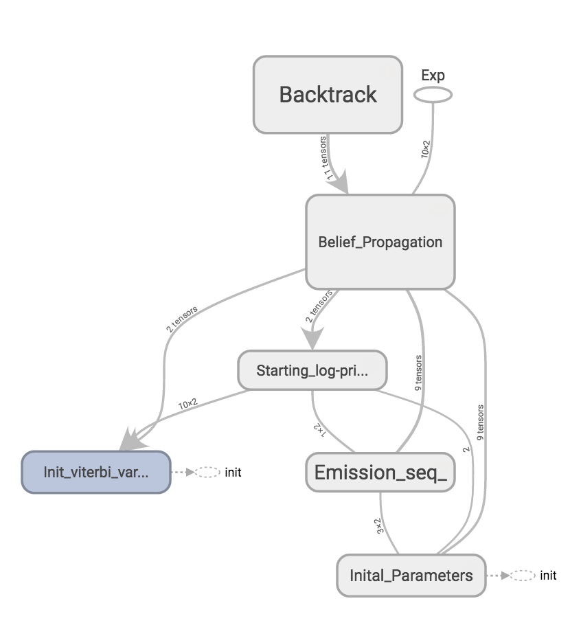
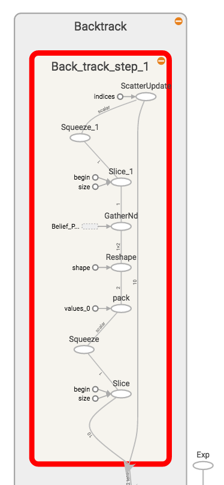
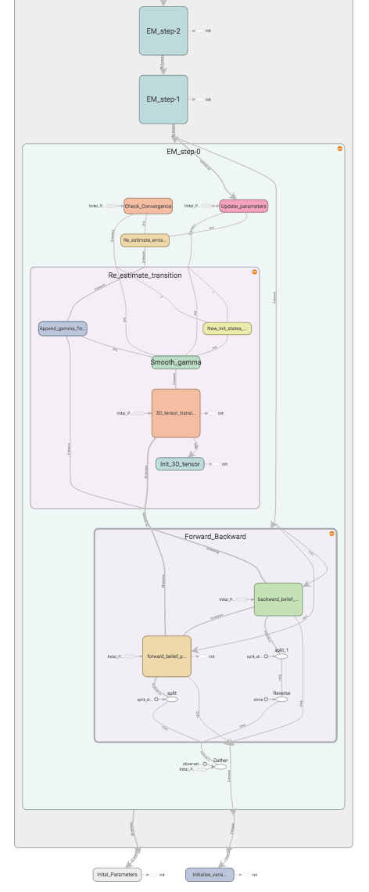
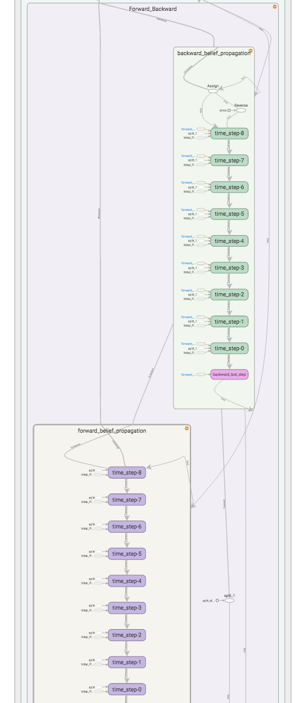
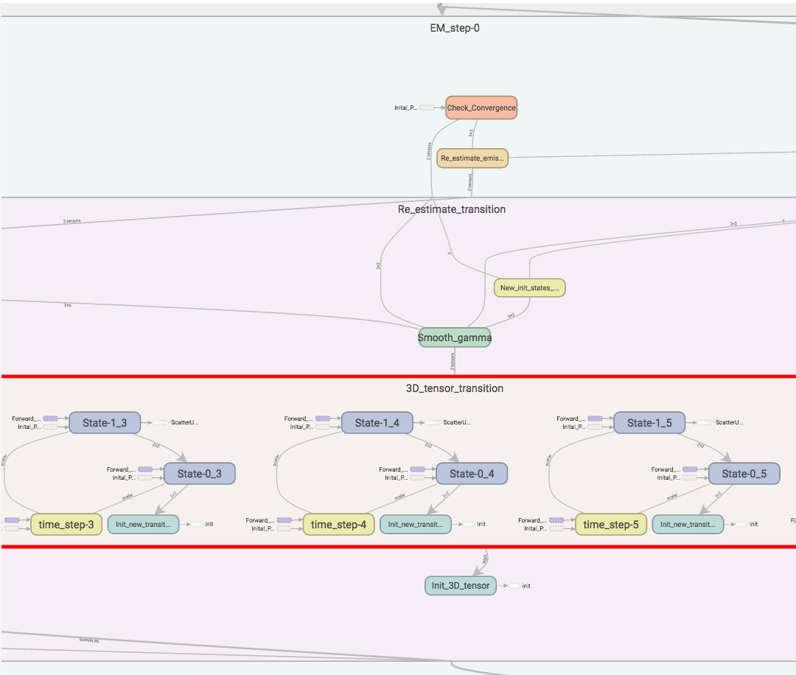
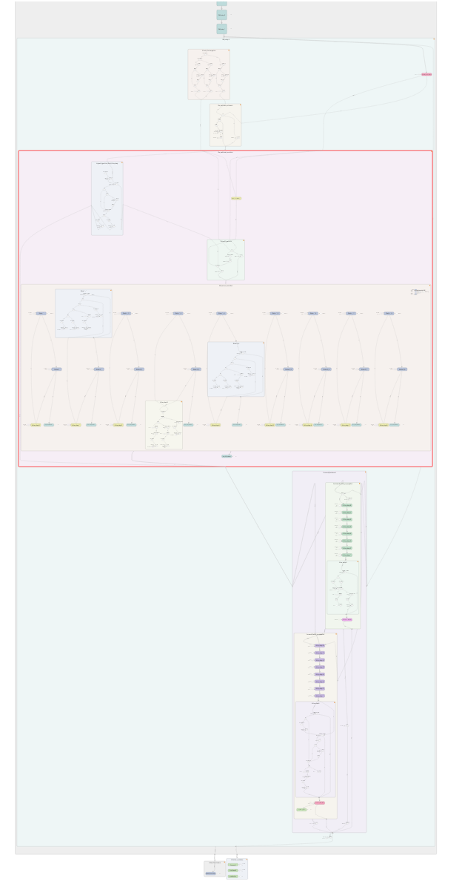

# Hidden Markov Model in TensorFlow

##Jupyter Notebook:
[Check out the Notebook for Examples.](http://nbviewer.jupyter.org/github/MarvinBertin/HiddenMarkovModel_TensorFlow/blob/master/HiddenMarkovModel.ipynb)

## Viterbi Algorithm
* Efficient way of finding the most likely state sequence.
* Method is general statistical framework of compound decision theory. 
* Maximizes a posteriori probability recursively.
* Assumed to have a finite-state discrete-time Markov process.

## Forward-Backward Algorithm
* The goal of the forward-backward algorithm is to find the conditional distribution over hidden states given the data.
* It is used to find the most likely state for any point in time.
* It cannot, however, be used to find the most likely sequence of states (see Viterbi)

## Baum Welch Algorithm
  * Expectation Maximization Inference of unknown parameters of a Hidden Markov Model.

# Viterbi

**Unrolled graph**

**Belief Propagation**

**Backtrack**

# Baum Welch and Forward-Backward

**Forward-Backward**

**Re-estimate**

**Unrolled**

